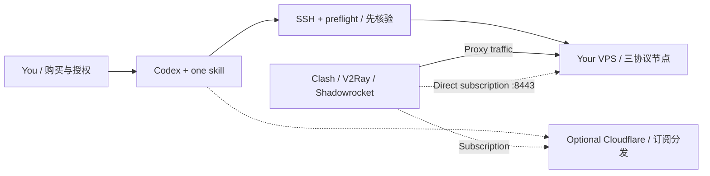

<div align="center">

# 🌐 VPS Proxy Skill

### Codex Skill for Self-hosted VPN & Proxy Deployment

**你准备服务器，Codex 负责把它变成可用的私人节点。**

面向自建 VPN、翻墙、科学上网与“魔法”网络配置的 Codex Skill：在自己的 VPS 上部署 Hysteria2、Trojan、VLESS REALITY，生成 Clash / Mihomo、V2Ray 与小火箭订阅。


[中文](#中文) · [English](#english) · [打开技能 / Skill](./skill/vps-proxy-builder/SKILL.md) · [架构 / Architecture](#architecture) · [项目地图 / Map](#project-map)

少刷一份教程，多交付一个能验证、能维护、能恢复的结果。

</div>

---

## 中文

### ✨ 不再让每个人从头学一遍搭建节点

这个项目把一次真实 VPS 部署中的脚本、问题、修复方法和判断依据，整理成了 **一个 Codex 专用 Skill**。

如果你正在寻找“Codex 自动搭建节点”“VPS 翻墙教程”“自建 VPN”“科学上网”或“魔法上网”的部署方案，这里提供的是一套可审查、可执行的代理自动化工作流，而不是公共机场、免费节点合集或订阅售卖服务。

你不必先去 YouTube 或 X 拼接教程，再逐项研究 TLS、systemd、订阅格式和防火墙。把仓库交给能执行终端命令的 Codex，让它检查环境、指导 SSH、完成配置、逐项验收，并留下以后能接着维护的记录。

**目标是自动完成已授权的技术工作，不是跳过人的控制权。** 购买、账号登录、MFA、必要授权和无法远程代办的家庭网络测试，仍需要你参与。

### 🚀 复制给你的 Codex

```text
请使用这个仓库，帮我在自己的 VPS 上搭建私人代理节点：
https://github.com/jedliuai/vps-proxy-skill

先获取完整仓库，阅读根目录 AGENTS.md 和
skill/vps-proxy-builder/SKILL.md，按其中的流程执行。
先检查你能用的工具、仓库权限和我的 VPS 条件。
我不熟悉 SSH，请在需要时指导我配置，不要让我提供私钥正文。
先说明目标服务器和要改什么，经我确认后连续完成范围内的工作。
优先跑通直连订阅；需要 Cloudflare 时再协助安装/授权必要插件。
不要覆盖已有服务、关闭证书校验或把凭据提交到 GitHub。
最后给我适用于 Clash 和 V2Ray/小火箭的两个已验证订阅入口，
以及已测/未测结果和恢复说明。遇到权限或购买步骤再让我参与。
```

> [!IMPORTANT]
> 这是一个可公开读取的独立仓库，可以直接把上面的地址发给 Codex。代码公开不等于提供免费节点或授予云账号权限：你仍需准备自己的 VPS、域名和授权。仓库不包含作者的实际订阅、密钥或运行配置；详见 [安全约定](./SECURITY.md)。

**不必先全局安装技能。** 把完整仓库作为 Codex 项目打开，它可按 `AGENTS.md` 读取技能。`skill/` 不是 Codex 默认自动扫描目录，因此提示词明确给出文件路径。若另行安装了技能，也需要完整仓库中的部署脚本。[Codex 技能说明](https://learn.chatgpt.com/docs/build-skills)

### 🧰 要安装哪些插件？

| 工具 / 插件 | 是否必需 | 用来做什么 |
| --- | --- | --- |
| Codex + 可用终端、网络权限 | **必需** | 读取代码、执行检查、通过 SSH 配置 VPS |
| Git + OpenSSH | **必需能力** | 获取仓库、连接和传输文件，不需要另找 SSH 插件 |
| GitHub 插件 / 连接器 | 可选便利 | 访问仓库；已有权限的 Git / `gh` 可以替代 |
| Cloudflare 插件 | 使用 Cloudflare 时推荐 | DNS、Workers、KV 等能力需实际授权；缺失操作可用 API / Wrangler |
| 浏览器控制插件 | 可选 | 协助操作控制台；登录、MFA、付款由你完成 |

**没有其他必须凑齐的插件包。** 插件已安装不代表账号已授权，也不代表支持所有写入操作。Codex 会先核对实际能力；插件使用方式参见[官方说明](https://learn.chatgpt.com/docs/plugins)。本地依赖按需准备，VPS 不需要安装 Codex、Node 或 Docker 面板。

### 📦 你准备什么，Codex 负责什么？

| 你提供或确认 | Codex 按技能负责 |
| --- | --- |
| 自己购买、可管理的 VPS | 检查系统、资源、监听端口与现有业务 |
| SSH 初始入口；不会可以让它指导 | 公钥/alias 配置，新非 root 登录与 sudo 验证，保留救援入口 |
| 可控制的域名或子域名 | 检查 DNS、证书条件、云防火墙，生成节点配置 |
| 账户授权与变更范围 | 在范围内部署、验证、可选发布 Cloudflare 订阅 |
| 家庭网络/客户端测试配合 | 区分服务器成功和真实使用成功，给出恢复及维护记录 |

当前自动化基线是 **专用 Debian 13、x86_64、systemd、SSH 22、公网 IPv4**。域名用于有效 TLS 证书；已有域名可用子域名。Cloudflare 不是必需项。

ARM、Ubuntu、自定义 SSH 端口、仅 IPv6/NAT 或共享业务主机暂不属于开箱基线，Codex 必须先停下说明适配需求，不能硬跑。模板默认是中国家庭网络分流和 `US-*` 名称；其他地区部署需按真实地域调整标签与策略。

### 🛡️ 自动化也要有刹车

- 没有自己的参数就停止，不再默认指向作者服务器或域名。
- 新非 root 密钥 SSH 和 sudo 必须先验证，避免禁用 root 后把自己锁在门外。
- 部署门禁检查平台、声明的授权与监听冲突；DNS、云权限和恢复点另行核实。
- 固定版本、下载校验、部署互斥和备份；不把完整重装当订阅更新按钮。
- 私钥、密码与真实订阅不进 Git，也不交给公共订阅转换网站。
- 先保住可用节点，再做最小修复；第一次安装失败先诊断，不无限重试。

首次使用此公开版本请独立克隆 `vps-proxy-skill`，不要合并旧私有仓库的 Git 历史；之后正常更新本仓库即可。**不需要为了安装这个 Skill 重部署线上节点**。新版完整部署要求显式参数及 SSH/变更/CA 条款确认，见[部署参考](./skill/vps-proxy-builder/references/deployment.md)。

### 💡 把真实踩坑经验交给下一次部署

技能里记录了：未认证 fallback 外发带宽、连接风暴、全局限速误伤、Trojan 最小端口迁移、证书权限和续期、UA 识别错误、Worker 与 KV 没同步、订阅刷新后重连，以及如何区分 Codex 资源占用和跨境链路丢包。

每个案例都保留“先看什么、证据是什么、最小修复是什么、什么时候不能套用”，不是一串遇错就重装的命令。[查看诊断手册](./skill/vps-proxy-builder/references/troubleshooting.md)

### 💰 费用与限制

本仓库不提供服务器、付费代理上游或订阅服务。你自行承担 VPS、公网 IP、流量、域名、可选 Cloudflare 与 Codex 使用费用，按各服务当前计费规则确认。作者的试用额度不适用于其他用户；预算告警也不是硬性消费上限。

三个协议共享一台 VPS 的出口，不能变成多个国家，也不提供跨服务器高可用。Cloudflare 在这里仅分发订阅，不改善主要跨境数据链路，不保证任何网站永久接受该 IP。使用应符合服务提供商条款及适用要求。

### ❓ 搜索这些词时，你会得到什么？

**这是传统 VPN 服务吗？** 搜索中常把此类需求称为“自建 VPN”，但本仓库实际部署的是 Hysteria2、Trojan 和 VLESS REALITY 代理，不是 WireGuard / OpenVPN，也不承诺接管整台设备的所有流量。

**翻墙、科学上网、魔法上网需要自己看完教程吗？** 可以把上面的提示词交给 Codex，由它按 Skill 检查前提并完成已授权的技术步骤；购买、账户登录与必要授权仍由你处理。

**Clash、V2Ray、小火箭能用同一套节点吗？** 可以使用支持对应协议的客户端；交付分别适配 Clash/Mihomo 的 YAML 与 v2rayN/v2rayNG/Shadowrocket 的 URI/Base64 订阅。规则和自动切换组不会通过 URI 自动复制。

---

## English

### ✨ Give Codex the repository, not a pile of tutorials

VPS Proxy Skill packages a real deployment's scripts, incidents, fixes and decision rules into **one Codex-specific skill**. Codex handles SSH preparation, configuration, diagnosis, validation and handoff, so every user does not have to reconstruct the workflow from videos and posts.

For users searching for **self-hosted VPN, VPS proxy setup, censorship circumvention, or automated proxy deployment**, this repository provides Hysteria2, Trojan and VLESS REALITY automation with Clash/Mihomo and V2Ray/Shadowrocket subscriptions. It deploys application proxies—not WireGuard/OpenVPN—and does not provide public servers or free subscription lists.

Automation covers **authorized technical work**. You retain control over purchases, account sign-in, MFA, permissions and any home-network checks Codex cannot perform remotely. This is not a promise that every model or environment can finish unattended.

### 🚀 Copy into Codex

```text
Use https://github.com/jedliuai/vps-proxy-skill to set up a private proxy on my VPS.
Obtain the complete repository and read AGENTS.md and
skill/vps-proxy-builder/SKILL.md before acting.
Check your tools, repository access and my server's prerequisites first.
Help me prepare SSH if needed; never ask for private-key contents.
Explain the target host and planned changes, then complete the approved work.
Verify direct subscriptions first; use Cloudflare only when needed and authorized.
Do not overwrite existing services, disable TLS verification or commit credentials.
Deliver two verified subscription entries for Clash and V2Ray/Shadowrocket,
test results with unverified items clearly marked, and recovery instructions.
Ask for my participation when account access, purchases or new authority is needed.
```

> [!IMPORTANT]
> This is an independent, publicly readable repository: you can give the URL directly to Codex. Public code does not provide free proxy servers or cloud-account access. Bring your own VPS, domain and authorization. The repository excludes the author's live subscriptions, secrets and runtime configuration. See [Security](./SECURITY.md).

Open the full checkout as a Codex project; global skill installation is unnecessary. `AGENTS.md` points to the skill explicitly because the singular `skill/` directory is not a default discovery location. An independently installed copy still requires the full repository. [Official skill documentation](https://learn.chatgpt.com/docs/build-skills)

### 🧰 Tools, not a mandatory plugin bundle

Codex needs terminal/network access, Git and OpenSSH. A GitHub connector is convenient but an authenticated Git/`gh` workflow also works. The Cloudflare plugin is recommended **only for Cloudflare delivery**; inspect its actual tools and permissions, then use authorized API/Wrangler operations where needed. Browser control is optional for console assistance. Installation alone does not grant account permissions. [Official plugin documentation](https://learn.chatgpt.com/docs/plugins)

The user provides the VPS, an initial SSH route, a controlled domain and authorization. Codex prepares the technical setup, verifies a fresh non-root key login and sudo, preserves recovery access, deploys and tests each protocol, then delivers a minimal client handoff. Codex itself does not need to run on the VPS.

### 📦 Supported baseline and safety

- Dedicated **Debian 13 / x86_64 / systemd / SSH 22 / public IPv4**, plus a controlled domain for valid TLS certificates.
- ARM, Ubuntu, custom SSH ports, IPv6-only/NAT-only and shared application hosts require a separately reviewed adaptation. They are not silently supported.
- Cloudflare is optional: validated direct HTTPS subscriptions are enough to start. The generated template assumes China-oriented routing and historical `US-*` labels; adapt labels/policies to the actual region.
- Explicit user parameters, a read-only readiness gate, independently verified SSH access, checksums, deployment locking and backups precede changes. The bootstrap is **not** a transactional full-system rollback tool.
- Preserve functioning nodes; diagnose before upgrading, rotating credentials or redeploying. Never commit secrets or send them to public subscription converters.
- Clone `vps-proxy-skill` independently; do not merge old private Git history into it. Existing installations do not need a live redeployment to adopt this skill. The updated full-deploy entrypoint requires explicit parameters and SSH/change/CA confirmations.

The skill includes practical incident playbooks for fallback relay traffic, connection storms, rate-limit exhaustion, TLS permissions, renewal, stale KV, client-format detection and misleading “subscription refresh fixed it” behavior. Detailed operational references are in Chinese; Codex should explain and execute them in the user's language.

### 💰 Boundaries

Users pay their own VPS, public IP, bandwidth, domain, optional Cloudflare and Codex costs. Historical trial credits are not transferable; budget alerts are not spending caps. One VPS has one exit location, not three countries or multi-server high availability. Cloudflare distributes subscriptions; it does not optimize the main proxy path or guarantee third-party site access.

---

<a id="architecture"></a>

## 🧭 Architecture · 一条执行链，两类流量



| Component / 组件 | Port / 端口 | Role / 用途 |
| --- | --- | --- |
| Hysteria2 | UDP 443 | 首选候选 / Preferred candidate, validate on the user's network |
| Xray Trojan TLS | TCP 10443 | TLS TCP 兼容入口 / TLS TCP option |
| Xray VLESS + REALITY + Vision | TCP 2053 | TCP 备用 / Alternate TCP path |
| Nginx | TCP 80 / 8443 | ACME、直连订阅、本机 TLS target / ACME, direct subscriptions, local TLS target |
| Cloudflare Worker + KV | Optional HTTPS | 订阅分发，不承载代理流量 / Subscription delivery only |

Repository pins / 仓库固定版本：Xray `v26.3.27` · Hysteria2 `v2.12.1` · Wrangler `4.127.1`。Not claims of being the latest; verify security advisories and compatibility before changing them.

## 🧪 Evidence, not promises · 验证边界

仓库提供本地隐私模式扫描、部署静态检查，以及 Worker、主机预检、运维入口和端口迁移测试。它们验证工具行为，不代表某台 VPS 已经安装成功，也不能替代真实客户端、家庭网络和晚高峰验收。[验收参考](./skill/vps-proxy-builder/references/validation.md)

Local checks cover secret patterns, deployment invariants, the Worker, readiness checks, the entrypoint and port migration. They are not fresh-server deployment results or an uptime guarantee. The skill must collect new evidence for every user's host, including real-client and home-network acceptance.

```text
pwsh scripts/validate-repo.ps1
python -B scripts/test-preflight.py
python -B scripts/test-entrypoint.py
python -B scripts/test-trojan-migration.py
git diff --check
```

以上检查不连接 VPS。The checks above do not connect to a VPS.

<a id="project-map"></a>

## 📚 Project map · 给 Codex 的工具箱

| Entry / 入口 | Purpose / 用途 |
| --- | --- |
| [AGENTS.md](./AGENTS.md) | 仓库行为约定与技能入口 / Repository instructions |
| [SKILL.md](./skill/vps-proxy-builder/SKILL.md) | 唯一 Codex 技能 / The single skill |
| [准备 / Prerequisites](./skill/vps-proxy-builder/references/prerequisites.md) | 插件、SSH、域名、权限、恢复点 |
| [部署 / Deployment](./skill/vps-proxy-builder/references/deployment.md) | 直连优先，可选 Cloudflare；参数与副作用 |
| [排障 / Troubleshooting](./skill/vps-proxy-builder/references/troubleshooting.md) | 症状、证据、最小修复与回退 |
| [验收 / Validation](./skill/vps-proxy-builder/references/validation.md) | 逐协议、用户网络、两链接交付 |
| [deploy/](./deploy/) · [scripts/](./scripts/) · [Worker](./cloudflare-worker/) | 可审查的执行源码与测试 / Source and tests |
| [SECURITY.md](./SECURITY.md) | 凭据与泄漏处理 / Credential boundaries |
| [worklog/](./worklog/) | 公共工具箱的维护记录，不存放个人实例档案 / Public project maintenance notes, not private host records |

公开仓库只保留可复用的 Skill、脚本、测试和维护说明。个人实例配置、运行日志、订阅及备份不属于公共文档；复用排障方法请读 Skill 参考，而不是复制某个人的服务器记录。This repository keeps reusable skills, source, tests and project notes. Personal host inventories, runtime logs, subscriptions and backups do not belong here; use the skill's incident playbooks instead.

---

<div align="center">

**把重复劳动交给 Codex，把选择权留给人。**<br>
Let Codex handle the repetition. Keep people in control.

</div>
